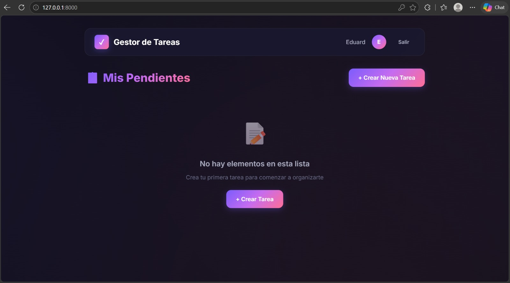
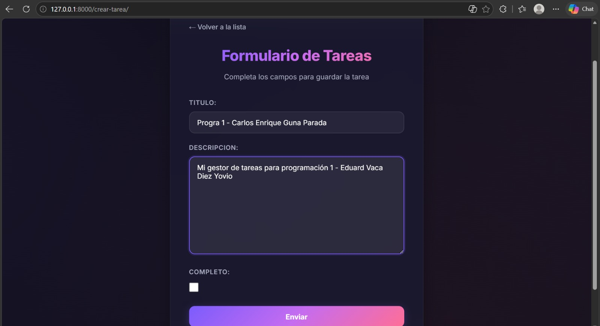

# Gestor de Tareas

Un gestor de tareas sencillo y eficiente desarrollado con **Django**. Permite a los usuarios registrarse, iniciar sesión y gestionar sus propias tareas de manera privada.

## Características Principales

*   **Sistema de Autenticación:** Registro, inicio de sesión y cierre de sesión de usuarios.
*   **Privacidad de Datos:** Cada usuario tiene acceso exclusivo a su propia lista de tareas. Ningún usuario puede ver las tareas de otros.
*   **Operaciones CRUD completas:**
    *   **Crear:** Añadir nuevas tareas indicando un título y una descripción opcional.
    *   **Leer:** Ver la lista de tareas pendientes y completadas, así como el detalle individual de cada una.
    *   **Actualizar:** Editar la información de las tareas y marcar su estado como completado o no completado.
    *   **Eliminar:** Borrar tareas de la lista.

## Tecnologías Utilizadas

*   **Backend:** Python 3, Django
*   **Base de Datos:** SQLite (configuración por defecto de Django)
*   **Frontend:** HTML, CSS (mediante las plantillas de Django)

## Capturas de Pantalla

A continuación, algunas capturas de la interfaz de la aplicación:

<p align="center">
  
  &nbsp;
  
</p>

*(Las imágenes se encuentran en el directorio `img/` del proyecto)*

## Instalación y Ejecución Local

Para probar o continuar el desarrollo de este proyecto en tu máquina local, sigue estos pasos:

1.  **Clonar el repositorio:**
    ```bash
    git clone <URL_DEL_REPOSITORIO>
    cd GestorTareas
    ```

2.  **Crear y activar un entorno virtual (recomendado):**
    ```bash
    python -m venv venv
    
    # En Windows:
    venv\Scripts\activate
    
    # En macOS/Linux:
    source venv/bin/activate
    ```

3.  **Instalar Django:**
    Como no hay un archivo `requirements.txt`, simplemente instala Django en tu entorno virtual:
    ```bash
    pip install django
    ```

4.  **Aplicar las migraciones:**
    Prepara la base de datos ejecutando el siguiente comando:
    ```bash
    python manage.py migrate
    ```

5.  **Ejecutar el servidor local:**
    ```bash
    python manage.py runserver
    ```

6.  **Acceder a la aplicación:**
    Abre tu navegador y ve a [http://127.0.0.1:8000/](http://127.0.0.1:8000/). Podrás registrarte y comenzar a usar el Gestor de Tareas.

---
**Nota:** Este proyecto está listo para ser subido a Git. Asegúrate de que tu archivo `.gitignore` excluye la carpeta `venv/`, `__pycache__/` y la base de datos `db.sqlite3` si no deseas subir datos de prueba.